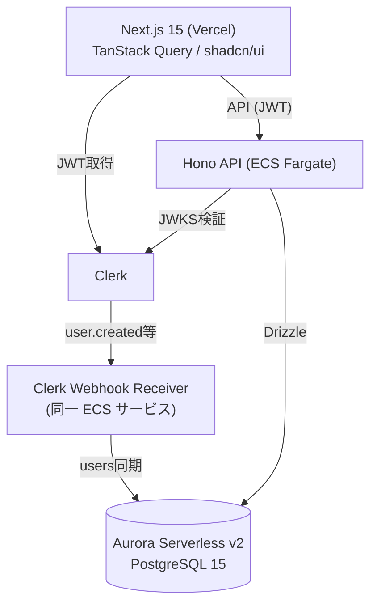
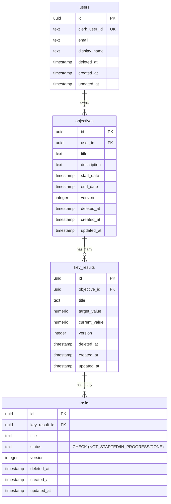

# Design Doc: Moonshot (PoC)

- Status: PoC In Progress
- Last Updated: 2026-04-21
- Author: Lead Engineer
- Phase: PoC (Phase 2 移行判断は本PoC完了後)

## 1. Context & Motivation

**ターゲットユーザー:** フロー状態を重んじるソフトウェアエンジニア(個人〜小規模チーム)。

**課題:** Jira, Asana 等の既存OKRツールは画面遷移とモーダルが多く、OKR更新自体が
「重いタスク」化している。結果としてOKRが形骸化する。

**仮説:** テキストエディタのような軽快さ(モードレス・インライン編集)と
深宇宙×ダークモードの世界観で、OKR更新を「毎日のワクワクするルーティン」に変えられるのではないか。
このPoCはこの仮説の技術的成立性を検証する。

## 2. Goals & Non-Goals

### Goals

- モードレスな体験: インライン編集 + 楽観的UIによる遅延ゼロ感
- 型安全性の貫通: DBスキーマ〜UIコンポーネントまでTypeScript型を完全同期
- View Transitions API によるネイティブライクな状態遷移

### Non-Goals (PoC 範囲外)

- チーム間コラボ(メンション、コメント)
- RBAC / カスタムワークフロー / SAML SSO
- モバイルネイティブアプリ
- Slack / Teams 連携
- ガントチャート / タイムライン表示

## 3. PoC で検証する仮説

| #             | 仮説                                                                                            | 検証方法                                           |
| ------------- | ----------------------------------------------------------------------------------------------- | -------------------------------------------------- |
| H1 (UX)       | 楽観的UI + インライン編集は「OKR更新が億劫でなくなる」体験差を生むか                            | Dogfooding で1週間連続使用、主観評価               |
| H2 (技術)     | Hono + TanStack Query の組み合わせで、3階層ネスト(O→KR→Task)の楽観的更新を破綻なく実装できるか  | キャッシュ整合性テスト、競合編集シナリオの手動検証 |
| H3 (インフラ) | Aurora Serverless v2 + ECS Fargate で想定コスト(~$80/月)とレイテンシ(p95 < 300ms)を両立できるか | 1週間連続稼働後の実測                              |

PoC 完了後、これらの結果をもとに Phase 2 (MVP) への移行判断を行う。

## 4. Architecture 概要

**技術スタック:** Turborepo / Next.js 15 / React 19 / TanStack Query v5 /
shadcn/ui + Tailwind / Hono / Clerk / Aurora Serverless v2 / Drizzle ORM /
ECS Fargate / Vercel / Terraform

## 5. Data Model

**主要な設計ポイント(詳細は ADR 参照):**

- 独自 UUID + `clerk_user_id` 紐付け(ADR 007)
- 論理削除は Read 時カスケード(ADR 008)
- `numeric(10,2)` で浮動小数点丸め誤差回避
- `status` は CHECK 制約(ENUM 変更困難を回避)
- 楽観的ロック `version` 列 + UPDATE 時に 409 Conflict

## 6. UI 機能一覧

ダッシュボード（`/dashboard`）に以下の UI 機能を実装済み:

### Objective

| 操作         | UI                                                                       | 実装パターン                        |
| ------------ | ------------------------------------------------------------------------ | ----------------------------------- |
| 作成         | テキスト入力 + 追加ボタン                                                | 楽観的更新（invalidate）            |
| タイトル編集 | インライン編集（クリックで入力に切替）                                   | 楽観的更新（onMutate）              |
| 期間設定     | startDate / endDate の date input                                        | 楽観的更新（onMutate）              |
| 進捗率表示   | 子 KR の `currentValue / targetValue` 平均を集計、プログレスバー + %表示 | フロントエンド算出（DB カラムなし） |
| 削除         | Undo トースト（5 秒猶予 + 取り消し）                                     | ADR 013                             |

### Key Result

| 操作           | UI                                          | 実装パターン                            |
| -------------- | ------------------------------------------- | --------------------------------------- |
| 作成           | Objective 内インライン追加                  | 楽観的更新（invalidate）                |
| タイトル編集   | インライン編集                              | 楽観的更新（onMutate）                  |
| 進捗更新       | `current / target` クリックで数値入力に切替 | 楽観的更新（onMutate, `String()` 変換） |
| プログレスバー | currentValue / targetValue のバー表示       | フロントエンド算出                      |
| 削除           | Undo トースト（5 秒猶予 + 取り消し）        | ADR 013 拡張                            |

### Task

| 操作           | UI                                                         | 実装パターン             |
| -------------- | ---------------------------------------------------------- | ------------------------ |
| 作成           | KR 内インライン追加                                        | 楽観的更新（invalidate） |
| ステータス変更 | Badge クリックで NOT_STARTED → IN_PROGRESS → DONE サイクル | 楽観的更新（onMutate）   |
| 削除           | Undo トースト（5 秒猶予 + 取り消し）                       | ADR 013 拡張             |

### 共通 UI パターン

- **インライン編集**: クリックで `` → `<input>` に切替、Enter で確定、Escape でキャンセル
- **Undo トースト**: プログレスバー付き。5 秒以内なら「元に戻す」で完全復元（API 未呼出）
- **View Transitions**: ルート遷移（fade + blur + Y shift）、ヘッダーアンカリング、ロゴモーフィング（ADR 015）
- **デザイントークン**: OKLCH 3 層構造（Primitive → Semantic → Tailwind）、ダークモード専用（ADR 010）

## 7. 主要な設計判断

詳細は各 ADR を参照:

- [ADR 001: フロントエンドへの Feature-Sliced Design の採用](../adr/001-frontend-feature-sliced-design.md)
- [ADR 002: Hono と Clean Architecture (手動DI) の採用](../adr/002-hono-clean-architecture.md)
- [ADR 003: インフラストラクチャの AWS 一元管理 (ECS Fargate + Aurora)](../adr/003-aws-ecs-aurora.md)
- [ADR 004: Clerk による認証基盤の採用](../adr/004-clerk-auth.md)
- [ADR 005: TanStack Query による状態管理と楽観的UI](../adr/005-tanstack-query.md)
- [ADR 006: shadcn/ui + Tailwind CSS v4 によるUI基盤](../adr/006-shadcn-ui.md)
- [ADR 007: ユーザーID設計と Clerk → Aurora 同期方式](../adr/007-user-id-sync.md)
- [ADR 008: 論理削除戦略 (Read 時カスケード)](../adr/008-soft-delete.md)
- [ADR 009: Idempotency-Key の保存先 (UNLOGGED TABLE)](../adr/009-idempotency-key.md)
- [ADR 010: デザイントークンと CSS 変数を用いたテーマ管理](../adr/010-design-tokens.md)
- [ADR 013: 破壊的操作における Undo トーストパターンの採用](../adr/013-undo-toast-pattern.md)
- [ADR 014: Hono RPC クライアントによる型安全な API 呼び出し](../adr/014-hono-rpc-client.md)
- [ADR 015: View Transitions API によるページ遷移アニメーション](../adr/015-view-transitions.md)

## 8. PoC 段階の簡略方針

以下は PoC フェーズで意図的に簡略化し、Phase 2 (MVP) 移行時に詳細化する:

- **セキュリティ:** Clerk JWT 検証 + `WHERE user_id = $authUserId` 必須化のみ。
  STRIDE, CORS/CSRF 詳細, Rate Limiting は Phase 2 で検討
- **観測:** CloudWatch 標準のみ。Sentry, 分散トレーシングは Phase 2
- **テスト:** 楽観的 UI の E2E (Playwright) のみ。Unit カバレッジ目標は Phase 2
- **コスト:** 月額 ~$80(内訳は ADR 003 / ADR 004 参照)
- **Rollout/Rollback:** PoC は Dogfooding のみ、切り戻し不要

## 9. Pre-mortem (PoC で頓挫するとしたら)

- **A**: 楽観的 UI のキャッシュキー設計バグで「保存されたように見えて未保存」が
  頻発し、Dogfooding 段階で仮説 H1 / H2 が否定される
- **B**: Aurora Serverless v2 の Cold Start で p95 300ms を恒常超過、仮説 H3 が否定される
- **C**: 技術は成立するが、Dogfooding で「既存ツールと変わらない」と主観評価され仮説 H1 が否定される。
  この場合、UI/UX を再設計するか、プロジェクト自体を中止する判断を行う

## 10. Open Questions

- **Q1. Webhook 受信失敗時の補償設計:** `user.updated` / `user.deleted` 欠損時の
  整合性回復方法(日次バッチで Clerk API から差分取得?)
- **Q2. DB マイグレーション運用:** Drizzle migrations を CI/CD のどこで実行するか
  (ECS タスク更新前か後か)
- **Q3. Server Components と TanStack Query の責務分担:** 初期データフェッチを
  どこまで Server Component で行い、どこから Client Component へ渡すか
- **Q4. 10,000 MAU 時のコスト試算:** Phase 2 移行判断時に再試算
- **Q5. Integration Test の DB 戦略:** `pg_cron` 拡張のテスト環境再現性

---

## Phase 2 移行時の TODO (このドキュメントには書かない、別途作成する)

- Non-Functional Requirements (SLO, RPO/RTO)
- Success Metrics (定量的KPI)
- Security 詳細 (STRIDE, CORS/CSRF, Rate Limiting)
- Observability 詳細 (Sentry, 分散トレーシング)
- Rollout & Rollback Plan
- Cost 詳細試算 (10,000 MAU 時)
- Testing Strategy 詳細 (カバレッジ目標、負荷試験)
